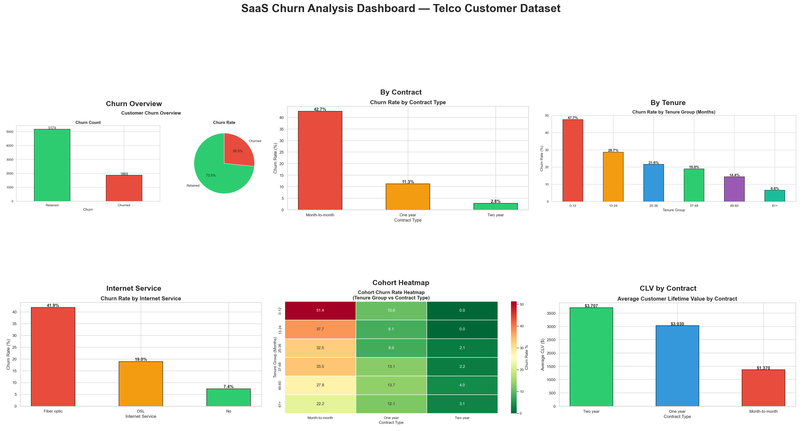

# 📉 SaaS Customer Churn & Retention Analysis

## 📌 Overview
Full-stack SaaS Churn & Retention Analysis on Telco Customer dataset 
(7,043 customers, 21 features) — covering cohort analysis, MRR tracking, 
CLV calculation and churn prediction using PostgreSQL (44+ queries) 
and Python (10 charts).

## 📊 Dashboard Preview

## 🔍 Key Insights
- Overall churn rate: **26.5%**
- Month-to-month contracts churn at **42.7%** vs Two year at **2.8%**
- Customers in first 12 months have **47.7%** churn rate
- Fiber optic customers churn at **41.9%** — highest among all services
- Two year contract customers have **3x higher CLV** ($3,707 vs $1,275)
- Senior citizens churn **41.7%** vs non-seniors at **23.6%**
- Customers with more services have lower churn rates

## 📁 Project Structure

## 🛠️ Tech Stack
| Tool | Purpose |
|------|---------|
| PostgreSQL 16 | 44+ SQL queries — cohort, MRR, CLV, churn scoring |
| Python 3.13 | EDA — 10 charts across all churn dimensions |
| Pandas | Data cleaning & feature engineering |
| Matplotlib/Seaborn | Visualisations including cohort heatmap |

## 📊 SQL Query Categories (44+ Queries)
| Section | Queries | Concepts |
|---------|---------|---------|
| Basic Exploration | 1-8 | SELECT, GROUP BY, CASE WHEN |
| MRR & Revenue | 9-16 | CLV, MRR, Revenue at Risk |
| Cohort Analysis | 17-22 | Cohort retention, survival analysis |
| Window Functions | 23-30 | LAG, LEAD, RANK, PERCENT_RANK |
| Advanced CTEs | 31-38 | Risk scoring, churn prediction |
| Business Insights | 39-44 | Summary report, CSV export |

## 💡 Business Recommendations
1. **Incentivise long-term contracts** — 2-year contracts have 15x lower churn
2. **Focus on first 12 months** — highest churn period needs onboarding investment
3. **Review Fiber Optic pricing** — 41.9% churn suggests value perception issues
4. **Senior citizen retention program** — 41.7% churn needs targeted support
5. **Bundle more services** — customers with more services churn significantly less

## 📂 Dataset
[Telco Customer Churn — Kaggle](https://www.kaggle.com/datasets/blastchar/telco-customer-churn)

